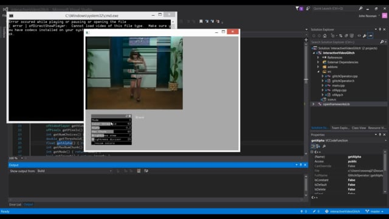

# Interactive Video Glitch
Program to interactively "glitch" or edit a video using openFrameworks. Given a video it will play back based on the input from the GUI (currently video and window dimension are hard coded). As of now the program implements various forms of pixel sorting and image abstraction algorithms.  

  <a href="https://vimeo.com/288464737">  

## Inspiration
To make a tool to glitch (or more accurately create "destructive" edits on) a given video and explore interesting algorithms that could be used.

## Issues
Currently the UI is not very intuitive and minimalistic. An end goal of doing this project is to make a standalone application to create art directed "glitched" images and videos that will export rendered images and videos. 

## Note
If attempting to only download the executable do not download the debug.exe as it is not optimized

